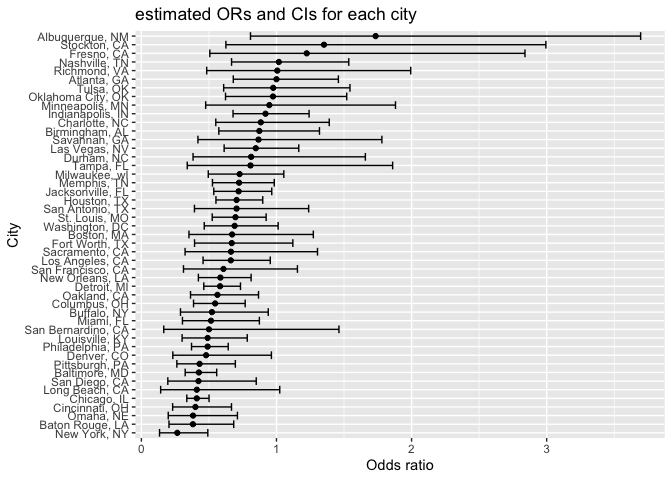

p8105_hw6_jy3270
================
Jingya Yu
2022-12-01

## Problem 2

-   import the data

``` r
homicide <- read_csv("./data/homicide-data.csv") %>% janitor::clean_names()
```

    ## Rows: 52179 Columns: 12
    ## ── Column specification ────────────────────────────────────────────────────────
    ## Delimiter: ","
    ## chr (9): uid, victim_last, victim_first, victim_race, victim_age, victim_sex...
    ## dbl (3): reported_date, lat, lon
    ## 
    ## ℹ Use `spec()` to retrieve the full column specification for this data.
    ## ℹ Specify the column types or set `show_col_types = FALSE` to quiet this message.

``` r
head(homicide)
```

    ## # A tibble: 6 × 12
    ##   uid    repor…¹ victi…² victi…³ victi…⁴ victi…⁵ victi…⁶ city  state   lat   lon
    ##   <chr>    <dbl> <chr>   <chr>   <chr>   <chr>   <chr>   <chr> <chr> <dbl> <dbl>
    ## 1 Alb-0…  2.01e7 GARCIA  JUAN    Hispan… 78      Male    Albu… NM     35.1 -107.
    ## 2 Alb-0…  2.01e7 MONTOYA CAMERON Hispan… 17      Male    Albu… NM     35.1 -107.
    ## 3 Alb-0…  2.01e7 SATTER… VIVIANA White   15      Female  Albu… NM     35.1 -107.
    ## 4 Alb-0…  2.01e7 MENDIO… CARLOS  Hispan… 32      Male    Albu… NM     35.1 -107.
    ## 5 Alb-0…  2.01e7 MULA    VIVIAN  White   72      Female  Albu… NM     35.1 -107.
    ## 6 Alb-0…  2.01e7 BOOK    GERALD… White   91      Female  Albu… NM     35.2 -107.
    ## # … with 1 more variable: disposition <chr>, and abbreviated variable names
    ## #   ¹​reported_date, ²​victim_last, ³​victim_first, ⁴​victim_race, ⁵​victim_age,
    ## #   ⁶​victim_sex

-   Create a city_state variable (e.g. “Baltimore, MD”), and a binary
    variable indicating whether the homicide is solved. Omit cities
    Dallas, TX; Phoenix, AZ; and Kansas City, MO – these don’t report
    victim race. Also omit Tulsa, AL – this is a data entry mistake. For
    this problem, limit your analysis those for whom victim_race is
    white or black. Be sure that victim_age is numeric.

``` r
homicide <- homicide %>%
  mutate(city_state = str_c(city, ", ", state),
        status = case_when(disposition == "Open/No arrest" ~ 0,
                   disposition == "Closed by arrest" ~ 1,
                   disposition == "Closed without arrest" ~ 0
        ),
        victim_age = as.numeric(victim_age)) %>%
        drop_na() %>%
        filter(victim_race %in% c("White", "Black"),
               city_state != "Dallas, TX",
               city_state != "Phoenix, AZ",
               city_state != "Kansas City, MO",
               city_state != "Tulsa, AL")
```

    ## Warning in mask$eval_all_mutate(quo): NAs introduced by coercion

``` r
head(homicide)
```

    ## # A tibble: 6 × 14
    ##   uid    repor…¹ victi…² victi…³ victi…⁴ victi…⁵ victi…⁶ city  state   lat   lon
    ##   <chr>    <dbl> <chr>   <chr>   <chr>     <dbl> <chr>   <chr> <chr> <dbl> <dbl>
    ## 1 Alb-0…  2.01e7 SATTER… VIVIANA White        15 Female  Albu… NM     35.1 -107.
    ## 2 Alb-0…  2.01e7 MULA    VIVIAN  White        72 Female  Albu… NM     35.1 -107.
    ## 3 Alb-0…  2.01e7 BOOK    GERALD… White        91 Female  Albu… NM     35.2 -107.
    ## 4 Alb-0…  2.01e7 MARTIN… GUSTAVO White        56 Male    Albu… NM     35.1 -107.
    ## 5 Alb-0…  2.01e7 GRAY    STEFAN… White        43 Female  Albu… NM     35.1 -107.
    ## 6 Alb-0…  2.01e7 BRITO   ELIZAB… White        22 Female  Albu… NM     35.1 -107.
    ## # … with 3 more variables: disposition <chr>, city_state <chr>, status <dbl>,
    ## #   and abbreviated variable names ¹​reported_date, ²​victim_last, ³​victim_first,
    ## #   ⁴​victim_race, ⁵​victim_age, ⁶​victim_sex

-   For the city of Baltimore, MD, use the glm function to fit a
    logistic regression with resolved vs unresolved as the outcome and
    victim age, sex and race as predictors. Save the output of glm as an
    R object;

``` r
Baltimore = homicide %>% filter(city_state == "Baltimore, MD")
Baltimore_fit = glm(status ~ victim_age + victim_race + victim_sex, data = Baltimore, family = binomial())
```

-   Apply the broom::tidy to this object; and obtain the estimate and
    confidence interval of the adjusted odds ratio for solving homicides
    comparing male victims to female victims keeping all other variables
    fixed.

``` r
Baltimore_fit %>%
  broom::tidy(conf.int = T, conf.level=0.95) %>% 
  mutate(OR = exp(estimate),
         conf_low = exp(conf.low),
         conf_high = exp(conf.high)) %>%
  select(term, OR, conf_low, conf_high) %>% 
  knitr::kable(digits = 3)
```

| term             |    OR | conf_low | conf_high |
|:-----------------|------:|---------:|----------:|
| (Intercept)      | 1.363 |    0.976 |     1.911 |
| victim_age       | 0.993 |    0.987 |     1.000 |
| victim_raceWhite | 2.320 |    1.650 |     3.276 |
| victim_sexMale   | 0.426 |    0.324 |     0.558 |

-   Now run glm for each of the cities in your dataset, and extract the
    adjusted odds ratio (and CI) for solving homicides comparing male
    victims to female victims.

``` r
glm_function = function(name) {
  fit = homicide %>%
    filter(city_state == name) %>%
    glm(status ~ victim_age + victim_race + victim_sex, data = ., family = binomial()) %>%
    broom::tidy(conf.int = T, conf.level=0.95) %>% 
    mutate(OR = exp(estimate),
           conf_low = exp(conf.low),
           conf_high = exp(conf.high)) %>%
    select(term, OR, conf_low, conf_high)
  return(fit)
}
```

-Create a dataframe with estimated ORs and CIs for each city.

``` r
all_result = tibble(
   city_states = unique(homicide$city_state),
  all_fits = map(city_states, glm_function)
  ) %>% unnest(all_fits) %>%
  filter(term == "victim_sexMale")
```

    ## Warning: glm.fit: fitted probabilities numerically 0 or 1 occurred

    ## Warning: glm.fit: fitted probabilities numerically 0 or 1 occurred

    ## Warning: glm.fit: fitted probabilities numerically 0 or 1 occurred

    ## Warning: glm.fit: fitted probabilities numerically 0 or 1 occurred

    ## Warning: glm.fit: fitted probabilities numerically 0 or 1 occurred

    ## Warning: glm.fit: fitted probabilities numerically 0 or 1 occurred

    ## Warning: glm.fit: fitted probabilities numerically 0 or 1 occurred

    ## Warning: glm.fit: fitted probabilities numerically 0 or 1 occurred

    ## Warning: glm.fit: fitted probabilities numerically 0 or 1 occurred

    ## Warning: glm.fit: fitted probabilities numerically 0 or 1 occurred

    ## Warning: glm.fit: fitted probabilities numerically 0 or 1 occurred

    ## Warning: glm.fit: fitted probabilities numerically 0 or 1 occurred

    ## Warning: glm.fit: fitted probabilities numerically 0 or 1 occurred

    ## Warning: glm.fit: fitted probabilities numerically 0 or 1 occurred

    ## Warning: glm.fit: fitted probabilities numerically 0 or 1 occurred

    ## Warning: glm.fit: fitted probabilities numerically 0 or 1 occurred

    ## Warning: glm.fit: fitted probabilities numerically 0 or 1 occurred

    ## Warning: glm.fit: fitted probabilities numerically 0 or 1 occurred

    ## Warning: glm.fit: fitted probabilities numerically 0 or 1 occurred

    ## Warning: glm.fit: fitted probabilities numerically 0 or 1 occurred

    ## Warning: glm.fit: fitted probabilities numerically 0 or 1 occurred

    ## Warning: glm.fit: fitted probabilities numerically 0 or 1 occurred

    ## Warning: glm.fit: fitted probabilities numerically 0 or 1 occurred

    ## Warning: glm.fit: fitted probabilities numerically 0 or 1 occurred

    ## Warning: glm.fit: fitted probabilities numerically 0 or 1 occurred

    ## Warning: glm.fit: fitted probabilities numerically 0 or 1 occurred

    ## Warning: glm.fit: fitted probabilities numerically 0 or 1 occurred

    ## Warning: glm.fit: fitted probabilities numerically 0 or 1 occurred

    ## Warning: glm.fit: fitted probabilities numerically 0 or 1 occurred

    ## Warning: glm.fit: fitted probabilities numerically 0 or 1 occurred

    ## Warning: glm.fit: fitted probabilities numerically 0 or 1 occurred

    ## Warning: glm.fit: fitted probabilities numerically 0 or 1 occurred

    ## Warning: glm.fit: fitted probabilities numerically 0 or 1 occurred

    ## Warning: glm.fit: fitted probabilities numerically 0 or 1 occurred

    ## Warning: glm.fit: fitted probabilities numerically 0 or 1 occurred

    ## Warning: glm.fit: fitted probabilities numerically 0 or 1 occurred

    ## Warning: glm.fit: fitted probabilities numerically 0 or 1 occurred

    ## Warning: glm.fit: fitted probabilities numerically 0 or 1 occurred

    ## Warning: glm.fit: fitted probabilities numerically 0 or 1 occurred

    ## Warning: glm.fit: fitted probabilities numerically 0 or 1 occurred

    ## Warning: glm.fit: fitted probabilities numerically 0 or 1 occurred

    ## Warning: glm.fit: fitted probabilities numerically 0 or 1 occurred

    ## Warning: glm.fit: fitted probabilities numerically 0 or 1 occurred

    ## Warning in regularize.values(x, y, ties, missing(ties), na.rm = na.rm):
    ## collapsing to unique 'x' values

``` r
all_result
```

    ## # A tibble: 47 × 5
    ##    city_states     term              OR conf_low conf_high
    ##    <chr>           <chr>          <dbl>    <dbl>     <dbl>
    ##  1 Albuquerque, NM victim_sexMale 1.73     0.808     3.70 
    ##  2 Atlanta, GA     victim_sexMale 1.00     0.680     1.46 
    ##  3 Baltimore, MD   victim_sexMale 0.426    0.324     0.558
    ##  4 Baton Rouge, LA victim_sexMale 0.381    0.204     0.684
    ##  5 Birmingham, AL  victim_sexMale 0.873    0.573     1.32 
    ##  6 Boston, MA      victim_sexMale 0.672    0.352     1.27 
    ##  7 Buffalo, NY     victim_sexMale 0.522    0.289     0.939
    ##  8 Charlotte, NC   victim_sexMale 0.884    0.551     1.39 
    ##  9 Chicago, IL     victim_sexMale 0.410    0.336     0.501
    ## 10 Cincinnati, OH  victim_sexMale 0.400    0.231     0.667
    ## # … with 37 more rows

-   Create a plot that shows the estimated ORs and CIs for each city.
    Organize cities according to estimated OR, and comment on the plot.

``` r
all_result %>% 
  mutate(city_states = fct_reorder(city_states, OR)) %>%
  ggplot(aes(x = OR, y = city_states)) +
  geom_point() +
  geom_errorbar(aes(xmin = conf_low, xmax = conf_high)) +
  ggtitle("estimated ORs and CIs for each city") +
  xlab("Odds ratio") +
  ylab("City")
```

<!-- -->

According the background of out analysis, a high estimated OR indicates
that homicide cases of male are more likely to be solved than female’s
case. Albuquerque, NM has the highest OR, which means that homicide
cases of male are most likely to be solved compared to other cities, if
we keep victims’ age and race fixed. On the other hand, New York NY has
the lowest estimated OR, which means that homicide cases of female are
most likely to be solved than other cities, if we keep victims’ age and
race fixed.
